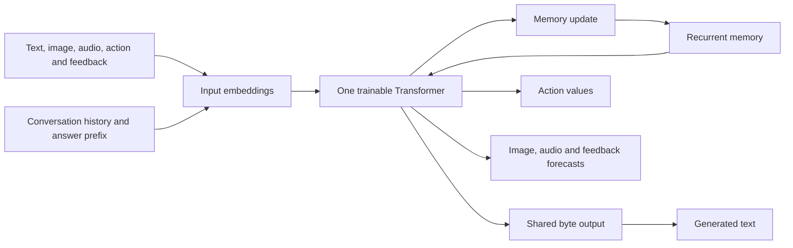

# Single-Core Predictive Agent

The `language_agent` assembly uses the original multimodal Transformer for
conversation, observation encoding, recurrent memory, action values and future
image/audio/feedback prediction. It contains one trainable core and one set of
text embeddings and output weights. No pretrained language model is loaded.

This corrects the [rejected two-model integration](research/language-agent-qwen-20260911.md).
That experiment connected a frozen native predictor to Qwen; its language
quality and native accuracy measurements do not describe the current model.

## Computation



`LanguageAgentModel` extends `MultimodalAgentModel` with conversation
serialization, assistant-answer loss and autoregressive generation. It adds no
parameters or second model. A native checkpoint loads strictly into exactly the
same parameter names and shapes. All weights remain trainable, including every
Transformer layer, the observation encoder, memory gate and output heads.

Conversation prompts use explicit role delimiters and the existing UTF-8 byte
vocabulary. The same observation update reads the prompt into recurrent memory;
the same Transformer and byte output layer predict answer bytes causally.
Assistant answers are supervised, while prompt positions are masked out of the
loss. Long answers are learned in chunks without inserting false end tokens.
The full conversation is saved, but each prompt uses its last 1,024 bytes.
Training uses up to 1,024 preceding bytes and a 1,024-byte answer chunk;
generation keeps a rolling 1,024-byte prefix. This bounded context is a practical
limit, not a claim of unlimited recall.

Chat turns update the same recurrent state used for action selection. Actual
observations and feedback also update it; forecasts do not overwrite actual
memory. A chat request generates text without executing a motor action.
Inference changes session state, while explicit training changes weights.

## Joint Learning And Persistence

Each update mixes complete native episodes and human OpenAssistant
conversations. Native losses supervise available action labels, TD values from
actual rewards, target words and next image/audio/feedback. Conversation loss
updates the same core and memory path. The TD target is a moving average of the
same parameter set, used only for training bootstraps.

`cycle` collects actual interactions, then replays them with retained experience
and conversations. With both episode sources and batch size at least two,
every update contains actor experience. Batch size one alternates sources.
World identities and conversation trees define evaluation split boundaries;
checkpoint provenance records source hashes and cumulative training identities.

Schema `intrep.language_agent_checkpoint.v3` stores the complete single model,
optimizer, target parameters and random-generator states. It loads without a
language backbone or external tokenizer. Earlier Qwen checkpoints are rejected.
Session schema v2 stores messages, common recurrent memory and actor random
state, bound to the exact model checkpoint. Exact resume preserves sampling and
optimizer state; initialization starts a new optimizer.

## Commands

Install the normal project dependencies:

```sh
uv sync --extra torch --extra vision --inexact
```

Conversation preparation is documented in [datasets](datasets.md#conversation-replay).
Initialize from the existing native model and jointly learn language:

```sh
uv run --inexact python scripts/train_language_agent.py \
  --native-checkpoint models/multimodal-agent-20260910/cycle/round-000/learning/checkpoint.pt \
  --selection data/multimodal-navigation-20260910/selection.json \
  --conversations data/language/agent-conversations-oasst1-20260911/train.jsonl \
  --validation-conversations data/language/agent-conversations-oasst1-20260911/validation.jsonl \
  --output runs/single-core-agent --steps 600 --batch-size 2 --device cuda
```

Promote checkpoints from disposable `runs/` into `models/` before depending on
them. Chat from a self-contained checkpoint:

```sh
uv run --inexact python -m intrep.problems.language_agent.cli chat \
  --checkpoint models/single-core-agent-20260911/cycle/learning/checkpoint.pt \
  --text '水が氷になる理由を説明してください。' \
  --output runs/single-core-chat --device cpu
```

`--session` restores a prior session; `--image`, `--audio`, `--previous-action`
and `--feedback` supply actual observations. `act`, `rollout`, `cycle` and
`evaluate` use this same checkpoint and require no `--base` argument.

## Verification Scope

Tests check that exactly one Transformer exists, all parameters are trainable,
and the model has exactly the original native parameter set. Independent
conversation, action and forecast losses reach that same Transformer's
attention/feed-forward weights and memory gate. Additional checks cover causal
answer masking, long-answer supervision, unchanged native initialization,
memory-dependent language, session persistence and exact replay resume.

Architecture and general language quality are separate requirements. Removing
Qwen also removes its pretrained language knowledge. A small native model
jointly trained on a bounded conversation set must be evaluated through its
actual outputs; structural tests and lower loss cannot establish reliable
conversation, explanation, translation or summarization.

## Measured Correction — 2026-09-11

The corrected model has 5,095,054 parameters (d256/h1024/heads8/l6, 32 memory
vectors), all trainable. Its 100 parameter tensors have exactly the same names
and shapes as the native initialization. All 100 changed during joint training
and again during actual-experience replay. The inference module tree contains
exactly one `SharedTransformerCore`.

Training used the retained 1,024 native episodes and 2,048 human conversations
(2,009 English and 39 Japanese), with batch size two and learning rate 0.0001.
After 600 joint updates, the actor collected eight six-action episodes with
15% exploration. Fifty additional updates each included one actor episode,
one retained episode and two conversations. The final checkpoint retains both
training stages' provenance. Actor records contain actual feedback rather than
privileged action or word labels; evaluation annotations are kept separately.

The same eight validation worlds provide 48 decisions at each stage. Language
validation uses 16 conversations from separate conversation trees. Byte losses
below cannot be compared numerically to the archived Qwen subword losses.

| Measurement | Native initialization | After 600 updates | After 50 actor replay updates |
| --- | ---: | ---: | ---: |
| Teacher action agreement | 42/48 (87.5%) | 44/48 (91.7%) | 43/48 (89.6%) |
| Assistant byte validation loss | 8.0767 | 2.9225 | 2.9055 |
| Target-word loss | 0.000136 | 0.001103 | 0.000667 |
| Change-weighted image loss | 0.10049 | 0.08765 | 0.09407 |
| Waveform MSE | 0.02362 | 0.02512 | 0.02383 |

During actual interaction collection, the actor matched the teacher on 36/48
exploratory decisions and the exact target word on 48/48. This validates the
executed experience loop within the navigation task. The small evaluation and
absence of an equal-compute control do not establish a causal improvement from
conversation training or new experience.

**General conversation remains unachieved.** The unconstrained Japanese
responses contain invalid UTF-8 sequences, and English responses repeat short
fragments. Conversation generation now masks invalid UTF-8 continuations, surrogate and
out-of-range codepoints, and incomplete codepoints at the byte budget boundary.
This repairs text encoding, not language understanding. A fresh CPU response to
an English introduction request begins `The an an an an the an an an` and does
not answer the request. A saved-session follow-up also fails semantically.
After the encoding repair, held-out Japanese answers repeat the character
`い`; they still do not answer the questions.
These failures are retained in the response records. Neither lower validation
loss nor valid Unicode is evidence that explanation, translation or summary
requests are being fulfilled.

A cold CPU check loaded only the complete checkpoint, without importing
Transformers, PEFT or bitsandbytes. It verified exact session restoration and
continuation, chat updates to common memory, and an image/audio-driven action
followed by actual feedback updating that same memory. The sequence took 9.96
seconds with two CPU threads; this is a multi-operation check, not per-response
latency. The actual reward in that example was -0.1, so it is execution evidence,
not a successful-behavior example.

Durable local artifacts:

- [Final single-core checkpoint](../models/single-core-agent-20260911/cycle/learning/checkpoint.pt)
- [Unedited response examples](../models/single-core-agent-20260911/conversations.md)
- [Structural and persistence verification](../models/single-core-agent-20260911/verification.json)
- [Training-stage evaluation](../models/single-core-agent-20260911/post-cycle/evaluation.json)
- [UTF-8-constrained generation evaluation](../models/single-core-agent-20260911/utf8-evaluation/evaluation.json)
- [Actual interaction replay](../models/single-core-agent-20260911/replay.html)
- [Artifact hashes](../models/single-core-agent-20260911/manifest.json)

The original GPU source snapshot is retained with the run; the corrected
Unicode decoder is recorded separately with the final source. No learned
parameters changed for the decoding repair. The GPU job retrieved its outputs
and deleted its disposable pod.

The final full unit suite passed 508 tests, and all 22 focused language/native
checks passed. These verify execution and invariants, not conversational quality.
