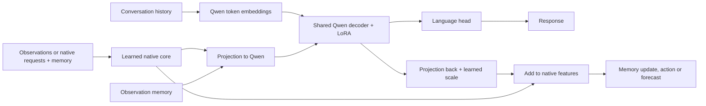

# Rejected Two-Model Language Integration — 2026-09-11

This is a historical record of the rejected Qwen/native integration. It did not
meet the single-core requirement. The implementation and commands below are
archived at commit `19c7573`; they are not the current supported interface.
Current implementation: [single-core agent](../language-agent.md).

# Language-Capable Predictive Agent

The `language_agent` assembly uses a pretrained language model as the shared
core for conversation, native observations, recurrent memory, action values and
future image/audio/feedback predictions. Ordinary conversation can produce
explanations, translations and summaries; it does not invoke the action head.

The earlier [multimodal agent](../multimodal-agent.md) was trained to emit target
color labels. Its text head was not evidence of general language ability.
That experiment remains separately documented so its measurements retain their
original meaning.

## Shared Computation



The assembly contains two pretrained parts: the language decoder and the
previously learned native predictor. The native predictor supplies useful
perception, memory and forecast features. Those features are projected into the
language decoder; its result is projected back and added as a small, learned
correction. Every native observation update, action readout and forecast executes
this shared language decoder. The correction also changes the memory carried to
later observations. Text observations are also tokenized directly for Qwen,
alongside the projected native features. With correction strength set to zero, the native operations
exactly reproduce the original predictor in the unit test.

Text conversation retains its complete message history, subject to the language
model context limit. Native observations
update the recurrent memory separately. When that memory is available, its
projection is included as a prefix in language generation. Questions use the
conversation path; they are not interpreted as new environment observations.
Predicted outcomes do not update memory as if they were actual observations.

The language initialization is
[Qwen3-4B-Instruct-2507](https://huggingface.co/Qwen/Qwen3-4B-Instruct-2507), pinned
to revision `cdbee75f17c01a7cc42f958dc650907174af0554`. Its existing language
ability supplies the starting point. This is not a claim to have acquired
language from scratch or introduced a new intelligence principle.

The language base is stored once in NF4 form. Joint training updates rank-eight
LoRA matrices inside attention and feed-forward projections, the projections
between native and language features, and their scales. The previously learned
native weights are frozen. The same LoRA weights are active for language,
observation, action and prediction. Tests verify their gradients separately
from conversation loss, action loss and image/audio forecast loss. No separate
answering service is called.

Native initialization uses the earlier experiment's final learned checkpoint,
including its cumulative source history. Raw image/audio support and native
skill therefore retain that experiment's scope: the navigation world. General
photo understanding, speech recognition and speech synthesis are not established
by this change.

## Learning And Persistence

Each optimizer step includes a conversation batch and a batch of complete
native episodes. Conversation loss supervises assistant responses, with prompt
tokens masked out. Native losses supervise available teacher actions, TD values
from actual rewards, target-color answers and the next image, waveform and
feedback. An exponential moving average of learned parameters supplies TD
bootstrap values. Frozen base weights are shared rather than duplicated for
this target calculation. Actor-generated episodes are sampled separately from
retained episodes: with both sources present and batch size at least two, every
batch includes actor experience. Batch size one alternates the sources. This
prevents a small collection of new experience from being missed in a short cycle.

Conversation trees and native world identities define separate split boundaries.
The selected source records and hashes are retained in checkpoints. Replay
sampling reconstructs observation memory from actual recorded history.

A checkpoint embeds the small frozen native initialization and its provenance,
plus learned parameters, optimizer state, target parameters and random-generator
states. Its language-base/tokenizer fingerprint must match when
loading. Exact resume preserves these states; initialization starts a new
optimizer while retaining the cumulative training-source history.

Inference session files contain conversation messages, recurrent memory and
actor random state. They are tied to the exact learned checkpoint. Sessions do
not change weights. The `cycle` command explicitly collects actual interactions
and then learns from their replay together with retained episodes and
conversations.

## Commands

Install the optional language dependencies without replacing the current
PyTorch environment:

```sh
uv sync --extra torch --extra vision --extra llm --inexact
```

Prepare conversation replay:

```sh
uv run --inexact python scripts/prepare_agent_conversations.py \
  --output data/language/agent-conversations-oasst1-20260911
```

Run commands from the repository root. The base directory contains the pinned
tokenizer and exported NF4 weights. The following export command uses CUDA.
Preparation and readiness checks are implemented in
`scripts/probe_language_backbone.py`; they do not train on the readiness prompts:

```sh
uv run --inexact python scripts/probe_language_backbone.py \
  --model Qwen/Qwen3-4B-Instruct-2507 \
  --revision cdbee75f17c01a7cc42f958dc650907174af0554 \
  --quantize --export-base --output runs/language-base-preparation
```

Promote the exported `base/` directory to a durable model directory before
training or depending on it for inference. The recorded file hashes identify
the exact exported tokenizer and weights.

Train with both sources:

```sh
uv run --inexact python -m intrep.problems.language_agent.cli train \
  --base models/backbones/qwen3-4b-instruct-2507-nf4-cdbee75 \
  --native-checkpoint models/multimodal-agent-20260910/cycle/round-000/learning/checkpoint.pt \
  --selection data/multimodal-navigation-20260910/selection.json \
  --conversations data/language/agent-conversations-oasst1-20260911/train.jsonl \
  --output runs/language-agent/learning --steps 100 --device cuda
```

Use `chat` for a conversation, optionally with `--image`, `--audio` or actual
feedback. Use `act` to request an environment action and forecasts. Both commands
write a `session.pt` that can be supplied to the next invocation with `--session`.

```sh
uv run --inexact python -m intrep.problems.language_agent.cli chat \
  --base models/backbones/qwen3-4b-instruct-2507-nf4-cdbee75 \
  --checkpoint models/language-agent-20260911/cycle/learning/checkpoint.pt \
  --text '水が氷になる理由を短く説明してください。' \
  --output runs/language-chat --device cpu
```

`scripts/train_language_agent.py` evaluates held-out conversation prompts and
native validation episodes before and after joint learning. The conversational
outputs are saved verbatim for inspection; a lower training loss is not treated
as proof that language quality or action competence improved.

## Measured Run — 2026-09-11

The adopted model uses 17,825,794 trainable parameters: shared language LoRA,
connecting projections and their scales. It draws replay from 2,048 selected
human conversations and 1,024 native training episodes. Conversation selection
contains 2,009 English and 39 Japanese assistant responses. The native
initialization also retains its earlier training-source history.

The run performed 100 joint updates, collected eight new six-step interaction
episodes, and performed another 20 updates. Every additional update included
one actor episode, one retained episode and two conversations. Actor records
contain actual observations, actions and feedback without privileged teacher
or target-word training labels.

The same eight held-out native validation worlds provide 48 recorded decisions
at each stage. Language validation loss uses 16 conversations from disjoint
conversation trees. These are held out from this run's replay; exposure during
Qwen's original pretraining is unknown.

| Measurement | Before joint learning | After 100 updates | After actual-experience replay |
| --- | ---: | ---: | ---: |
| Teacher action agreement | 42/48 (87.5%) | 42/48 (87.5%) | 42/48 (87.5%) |
| Conversation validation loss | 3.7763 | 1.6600 | 1.6559 |
| Observation-grounded word loss | 3.2349 | 0.0768 | 0.0911 |
| Native image loss, change-weighted | 0.10048 | 0.09961 | 0.09944 |
| Native waveform MSE | 0.02362 | 0.02370 | 0.02363 |

The original native checkpoint also scores 42/48 on these exact worlds. The
image/audio losses and action scores support retention of its measured native
behavior in this sample. They do not establish improved native skill.

During the eight real interactions, the actor used 15% random-action exploration.
It matched the annotated teacher on 35/48 decisions and emitted the exact target
word on 46/48. The two word errors occurred around a changed target cue. Thus
observation-grounded recall is still imperfect. These interactions were
collected by the 100-update checkpoint before the additional replay updates.

Additional replay changed all 508 trainable parameter tensors, including shared
language LoRA; all 252 LoRA output matrices are nonzero. The frozen native base
remained exactly unchanged. Including actual experience and observing parameter
updates establishes execution of the learning loop. An equal-compute control
without new experience was not run, so no causal performance gain is attributed
to the new experience.

The final checkpoint's unedited conversation examples include:

- Translation: `Yesterday, I went for a walk with my younger sister in the park.`
- Remembering a supplied name: `コハクです。`
- Following a correction: `変更後の集合日時：日曜日の午前11時`
- Arithmetic: `3人×2個＝6個 ... 残りは2個です`
- Python: a function filtering a list with `num % 2 == 0`.

The examples also expose limits: the ice explanation is shallow, and the summary
omits the stated opening hours. The loss reduction is not a blanket language
quality score. This change establishes ordinary language behavior alongside the
native agent; it does not establish general reliability or general audiovisual
understanding.

Durable local artifacts:

- [Final checkpoint](../../models/language-agent-20260911/cycle/learning/checkpoint.pt)
- [Full conversation examples](../../models/language-agent-20260911/conversations.md)
- [Actual interaction replay](../../models/language-agent-20260911/replay.html)
- [Final validation output](../../models/language-agent-20260911/post-cycle/evaluation.json)
- [Parameter, source and replay verification](../../models/language-agent-20260911/verification.json)

The full suite passed 505 tests. It covers native initialization preservation,
separate language/action/forecast gradients into the same decoder, assistant-only
loss masking, observation memory, session restoration, replay participation and
exact training resume. The GPU job retrieved its outputs and deleted its pod.

A separate CPU reload of the final checkpoint restored a saved conversation and
correctly recalled its supplied preference (`麦茶`). On a new question, it
explained day and night through Earth's rotation. It also consumed image/audio
observations, selected a native action, received actual feedback and then
answered the target-color question from updated observation memory. The
[recorded CPU check](../../models/language-agent-20260911/local-smoke/result.json)
contains the exact prompts and outputs.

The combined CPU verification sequence took 566 seconds with two threads on the
shared local host. It includes loading, multiple generations, native prediction
and feedback processing; it is not a per-response latency measurement. The CPU
path is functional but slow in this environment.
